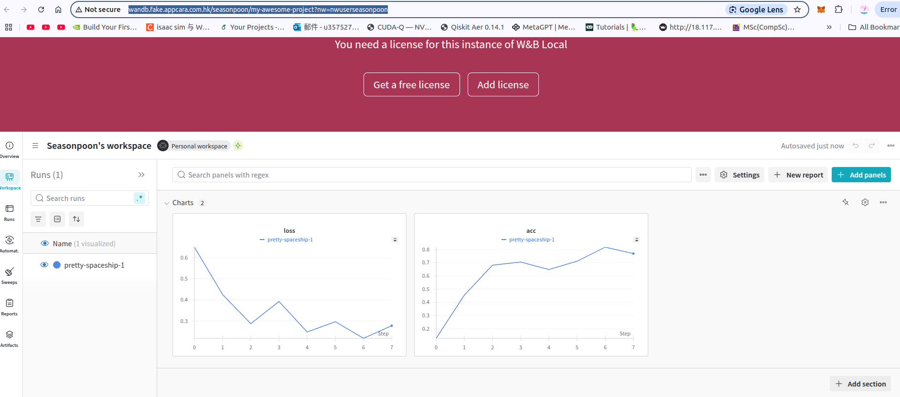

# Wandb Kube

## Setup

### Create a new namespace
```bash
kubectl create namespace wandb
```

### install helm chart
```bash
helm install local-wandb .  -n wandb
helm upgrade local-wandb .  -n wandb
```

### add ingress
```bash
echo "$(minikube ip) wandb.fake.appcara.com.hk"  # copy host to clipboard
sudo nano /etc/hosts
# add host to the end of the file
```

### Access wandb
`http://wandb.fake.appcara.com.hk/`

Create an account for your usage. Copy your API key found in [Wandb HomePage](http://wandb.fake.appcara.com.hk/home).

## Usage

### Install wandb python package
```bash
pip install wandb
```

### Login to wandb
```bash
wandb login --host=http://wandb.fake.appcara.com.hk
```
Login with your wandb account with API key.

### Run Sample script
```bash
python tests/helloworld.py
```
Sample output
```shell
wandb: Currently logged in as: seasonpoon to http://wandb.fake.appcara.com.hk. Use `wandb login --relogin` to force relogin
wandb: Using wandb-core as the SDK backend.  Please refer to https://wandb.me/wandb-core for more information.
wandb: Tracking run with wandb version 0.19.5
wandb: Run data is saved locally in /home/spoonbobo/kube-contribs/wandb/wandb/run-20250129_121259-sur26rox
wandb: Run `wandb offline` to turn off syncing.
wandb: Syncing run pretty-spaceship-1
wandb: ⭐️ View project at http://wandb.fake.appcara.com.hk/seasonpoon/my-awesome-project
wandb: 🚀 View run at http://wandb.fake.appcara.com.hk/seasonpoon/my-awesome-project/runs/sur26rox
wandb:                                                                                
wandb: 
wandb: Run history:
wandb:  acc ▁▄▇▇▆▇██
wandb: loss █▄▂▄▁▂▁▂
wandb: 
wandb: Run summary:
wandb:  acc 0.76897
wandb: loss 0.27827
wandb: 
wandb: 🚀 View run pretty-spaceship-1 at: http://wandb.fake.appcara.com.hk/seasonpoon/my-awesome-project/runs/sur26rox
wandb: ⭐️ View project at: http://wandb.fake.appcara.com.hk/seasonpoon/my-awesome-project
wandb: Synced 6 W&B file(s), 0 media file(s), 0 artifact file(s) and 0 other file(s)
wandb: Find logs at: ./wandb/run-20250129_121259-sur26rox/logs
```

Visualize the run, here is the sample image:

